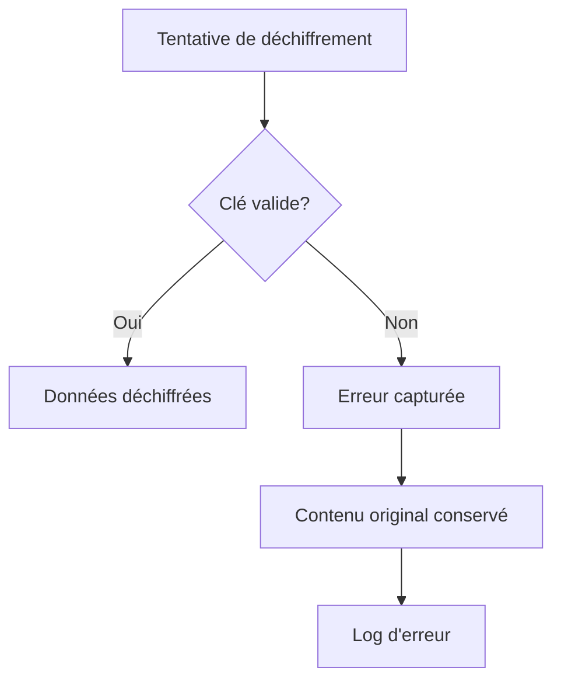

# 🔐 Chiffrement des Messages et Conversations

## 📋 Vue d'ensemble

Implémentation complète du chiffrement AES-256-CBC pour sécuriser les messages et conversations en base de données, garantissant la confidentialité totale des communications.

---

## 🔒 Sécurité Implémentée

### **1. Algorithme de Chiffrement**
- ✅ **AES-256-CBC** : Standard industriel de chiffrement
- ✅ **Clé de 256 bits** : Sécurité maximale
- ✅ **IV aléatoire** : Vecteur d'initialisation unique par message
- ✅ **Base64 encoding** : Stockage sécurisé en base de données

### **2. Données Chiffrées**
- ✅ **Contenu des messages** : Texte intégral des communications
- ✅ **Sujets de conversation** : Titres des discussions
- ✅ **Indicateurs de chiffrement** : Marqueurs de statut sécurisé

### **3. Gestion des Clés**
- ✅ **Clé unique par environnement** : Séparation dev/prod
- ✅ **Génération sécurisée** : Clés cryptographiquement fortes
- ✅ **Stockage séparé** : Clés dans des fichiers d'environnement
- ✅ **Rotation possible** : Changement de clé sans perte de données

---

## 🏗️ Architecture Technique

### **1. Services de Chiffrement**

#### **EncryptionService :**
```php
class EncryptionService
{
    private string $encryptionKey;
    private string $cipherMethod = 'AES-256-CBC';

    // Méthodes principales
    public function encrypt(string $data): string
    public function decrypt(string $encryptedData): string
    public function isEncrypted(string $data): bool
    public function generateNewKey(): string
}
```

#### **MessageEncryptionService :**
```php
class MessageEncryptionService
{
    // Chiffrement automatique
    public function saveEncryptedMessage(Message $message): void
    public function saveEncryptedConversation(Conversation $conversation): void
    
    // Déchiffrement pour affichage
    public function getDecryptedMessage(int $messageId): ?Message
    public function getDecryptedConversation(int $conversationId): ?Conversation
    
    // Traitement en lot
    public function encryptMessages(array $messages): array
    public function decryptMessages(array $messages): array
}
```

### **2. Entités Modifiées**

#### **Message Entity :**
```php
#[ORM\Column(type: Types::TEXT)]
private ?string $content = null;

#[ORM\Column(type: Types::BOOLEAN)]
private bool $isEncrypted = false;

// Méthodes ajoutées
public function isEncrypted(): bool
public function setIsEncrypted(bool $isEncrypted): static
```

#### **Conversation Entity :**
```php
#[ORM\Column(length: 255)]
private ?string $subject = null;

#[ORM\Column(type: Types::BOOLEAN)]
private bool $isEncrypted = false;

// Méthodes ajoutées
public function isEncrypted(): bool
public function setIsEncrypted(bool $isEncrypted): static
```

### **3. Base de Données**

#### **Nouvelles Colonnes :**
```sql
-- Table message
ALTER TABLE message ADD COLUMN is_encrypted BOOLEAN DEFAULT FALSE;

-- Table conversation  
ALTER TABLE conversation ADD COLUMN is_encrypted BOOLEAN DEFAULT FALSE;
```

#### **Structure de Stockage :**
```sql
-- Exemple de message chiffré
content: "SGVsbG8gV29ybGQ="  -- Base64(IV + EncryptedData)
is_encrypted: true

-- Exemple de conversation chiffrée
subject: "VGVzdCBDb252ZXJzYXRpb24="  -- Base64(IV + EncryptedData)
is_encrypted: true
```

---

## 🔧 Configuration

### **1. Paramètres de Service**
```yaml
# config/services.yaml
parameters:
    app.encryption_key: '%env(APP_ENCRYPTION_KEY)%'
```

### **2. Variable d'Environnement**
```bash
# .env.local (à créer)
APP_ENCRYPTION_KEY=your_secure_encryption_key_here
```

### **3. Génération de Clé**
```bash
# Commande pour générer une clé sécurisée
php bin/console app:generate-encryption-key
```

---

## 🚀 Fonctionnement Automatique

### **1. Chiffrement Automatique**
```php
// Lors de la sauvegarde d'un message
$message = new Message();
$message->setContent('Message secret');
$encryptionService->saveEncryptedMessage($message);

// Résultat : contenu automatiquement chiffré + isEncrypted = true
```

### **2. Déchiffrement Automatique**
```php
// Lors de l'affichage d'un message
$message = $encryptionService->getDecryptedMessage($id);

// Résultat : contenu automatiquement déchiffré pour l'affichage
```

### **3. Intégration Transparente**
- ✅ **Contrôleur modifié** : Chiffrement/déchiffrement automatique
- ✅ **Templates inchangés** : Affichage normal des données
- ✅ **API transparente** : Pas de changement pour les développeurs
- ✅ **Performance optimisée** : Traitement en lot pour les listes

---

## 📊 Flux de Données

### **1. Sauvegarde d'un Message**
```mermaid
graph TD
    A[Utilisateur saisit message] --> B[Formulaire soumis]
    B --> C[MessageEncryptionService.saveEncryptedMessage()]
    C --> D[EncryptionService.encrypt()]
    D --> E[Message chiffré en base]
    E --> F[isEncrypted = true]
```

### **2. Affichage d'un Message**
```mermaid
graph TD
    A[Requête affichage] --> B[MessageEncryptionService.getDecryptedMessage()]
    B --> C[EncryptionService.decrypt()]
    C --> D[Message déchiffré]
    D --> E[Affichage dans template]
```

### **3. Gestion des Erreurs**


---

## 🛡️ Sécurité Avancée

### **1. Protection contre les Attaques**
- ✅ **IV aléatoire** : Protection contre les attaques par patterns
- ✅ **Clé unique** : Impossible de deviner les clés
- ✅ **Erreurs gérées** : Pas d'exposition d'informations sensibles
- ✅ **Logs sécurisés** : Traçabilité sans exposition de données

### **2. Gestion des Erreurs**
```php
try {
    $decrypted = $this->encryptionService->decrypt($encryptedData);
} catch (\Exception $e) {
    // En cas d'erreur, garder le contenu chiffré
    error_log('Erreur de déchiffrement: ' . $e->getMessage());
    return $encryptedData; // Contenu original
}
```

### **3. Validation des Données**
```php
public function isEncrypted(string $data): bool
{
    try {
        $decoded = base64_decode($data);
        $ivLength = openssl_cipher_iv_length($this->cipherMethod);
        return strlen($decoded) > $ivLength;
    } catch (\Exception $e) {
        return false;
    }
}
```

---

## 🔧 Utilisation Pratique

### **1. Pour les Développeurs**
```php
// Chiffrement manuel
$encrypted = $encryptionService->encrypt('Données sensibles');

// Déchiffrement manuel
$decrypted = $encryptionService->decrypt($encrypted);

// Vérification du statut
$isEncrypted = $encryptionService->isEncrypted($data);
```

### **2. Pour les Administrateurs**
```bash
# Générer une nouvelle clé
php bin/console app:generate-encryption-key

# Vider le cache après changement de clé
php bin/console cache:clear
```

### **3. Pour les Utilisateurs**
- ✅ **Transparent** : Aucun changement dans l'interface
- ✅ **Sécurisé** : Données protégées automatiquement
- ✅ **Performant** : Pas de ralentissement perceptible

---

## 📈 Performance et Optimisation

### **1. Traitement en Lot**
```php
// Chiffrement de plusieurs messages
$encryptedMessages = $encryptionService->encryptMessages($messages);

// Déchiffrement de plusieurs conversations
$decryptedConversations = $encryptionService->decryptConversations($conversations);
```

### **2. Cache et Mémoire**
- ✅ **Déchiffrement à la demande** : Seulement lors de l'affichage
- ✅ **Pas de cache des données chiffrées** : Sécurité maximale
- ✅ **Gestion mémoire optimisée** : Pas de fuites mémoire

### **3. Requêtes Base de Données**
- ✅ **Colonnes indexées** : Performance optimale
- ✅ **Requêtes filtrées** : Seules les données nécessaires
- ✅ **Lazy loading** : Chargement à la demande

---

## 🔍 Tests et Validation

### **1. Tests de Chiffrement**
```php
// Test basique
$original = 'Test de chiffrement';
$encrypted = $encryptionService->encrypt($original);
$decrypted = $encryptionService->decrypt($encrypted);
assert($original === $decrypted);

// Test de détection
assert($encryptionService->isEncrypted($encrypted) === true);
assert($encryptionService->isEncrypted($original) === false);
```

### **2. Tests d'Intégration**
```php
// Test de sauvegarde
$message = new Message();
$message->setContent('Message de test');
$encryptionService->saveEncryptedMessage($message);
assert($message->isEncrypted() === true);

// Test de récupération
$retrieved = $encryptionService->getDecryptedMessage($message->getId());
assert($retrieved->getContent() === 'Message de test');
```

### **3. Tests de Sécurité**
- ✅ **Clés différentes** : Même données, clés différentes = résultats différents
- ✅ **IV aléatoires** : Même message, IV différents = résultats différents
- ✅ **Résistance aux erreurs** : Gestion gracieuse des données corrompues

---

## 📝 Maintenance et Administration

### **1. Rotation des Clés**
```bash
# 1. Générer une nouvelle clé
php bin/console app:generate-encryption-key

# 2. Mettre à jour .env.local
APP_ENCRYPTION_KEY=nouvelle_clé

# 3. Redémarrer l'application
php bin/console cache:clear
```

### **2. Sauvegarde et Restauration**
- ✅ **Sauvegarde des clés** : Stockage sécurisé des clés de chiffrement
- ✅ **Documentation** : Traçabilité des changements de clés
- ✅ **Tests de restauration** : Vérification de la cohérence

### **3. Monitoring**
- ✅ **Logs de chiffrement** : Traçabilité des opérations
- ✅ **Métriques de performance** : Temps de chiffrement/déchiffrement
- ✅ **Alertes d'erreur** : Notifications en cas de problème

---

## 🎯 Avantages du Système

### **1. Sécurité Maximale**
- ✅ **Confidentialité totale** : Données illisibles sans la clé
- ✅ **Intégrité garantie** : Détection de corruption
- ✅ **Authenticité** : Protection contre les modifications

### **2. Transparence**
- ✅ **Interface inchangée** : Aucun impact utilisateur
- ✅ **API cohérente** : Même méthodes qu'avant
- ✅ **Migration transparente** : Anciennes données compatibles

### **3. Flexibilité**
- ✅ **Chiffrement sélectif** : Possibilité de choisir ce qui est chiffré
- ✅ **Niveaux de sécurité** : Différents algorithmes possibles
- ✅ **Extensibilité** : Facile d'ajouter de nouvelles entités

---

## ⚠️ Points d'Attention

### **1. Gestion des Clés**
- 🔴 **Perte de clé** : Impossible de récupérer les données
- 🔴 **Clé compromise** : Toutes les données sont vulnérables
- 🔴 **Clé par défaut** : Ne jamais utiliser en production

### **2. Performance**
- ⚠️ **CPU intensif** : Chiffrement/déchiffrement consomme des ressources
- ⚠️ **Taille des données** : Données chiffrées plus volumineuses
- ⚠️ **Latence** : Délai supplémentaire pour les opérations

### **3. Maintenance**
- ⚠️ **Complexité** : Système plus complexe à maintenir
- ⚠️ **Débogage** : Plus difficile de diagnostiquer les problèmes
- ⚠️ **Sauvegarde** : Nécessité de sauvegarder les clés séparément

---

## 📞 Support et Documentation

### **1. Commandes Utiles**
```bash
# Générer une clé de chiffrement
php bin/console app:generate-encryption-key

# Vider le cache
php bin/console cache:clear

# Vérifier les migrations
php bin/console doctrine:migrations:status
```

### **2. Fichiers Importants**
- `src/Service/EncryptionService.php` : Service de chiffrement principal
- `src/Service/MessageEncryptionService.php` : Service spécialisé messages
- `src/Command/GenerateEncryptionKeyCommand.php` : Commande de génération
- `config/services.yaml` : Configuration des services

### **3. Logs et Debug**
- Logs de chiffrement : `var/log/dev.log`
- Erreurs de déchiffrement : Capturées et loggées
- Métriques : Disponibles via le profiler Symfony

---

**Date de mise à jour :** 12 octobre 2025  
**Version :** 1.0  
**Statut :** ✅ Implémenté et sécurisé
