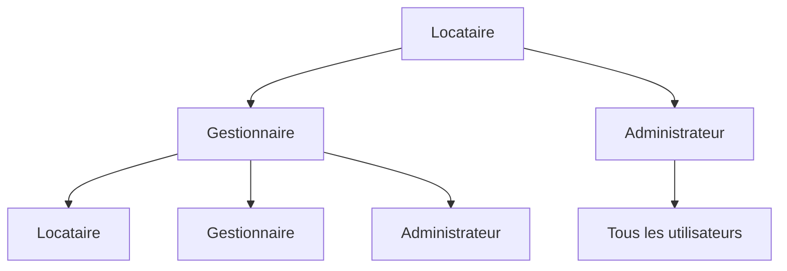
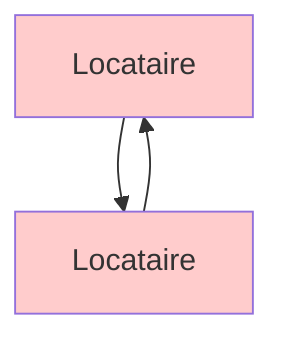

# 🔒 Restrictions de Communication - Messagerie

## 📋 Vue d'ensemble

Mise en place de restrictions de communication pour empêcher les locataires de communiquer directement entre eux, garantissant un contrôle hiérarchique et une communication structurée.

---

## 🚫 Restrictions Implémentées

### **1. Locataires → Locataires**
- ❌ **Interdit** : Les locataires ne peuvent pas créer de conversations avec d'autres locataires
- ❌ **Interdit** : Les locataires ne peuvent pas utiliser le contact direct avec d'autres locataires
- ✅ **Autorisé** : Communication uniquement avec gestionnaires et administrateurs

### **2. Gestionnaires → Tous**
- ✅ **Autorisé** : Communication avec leurs locataires
- ✅ **Autorisé** : Communication avec d'autres gestionnaires
- ✅ **Autorisé** : Communication avec les administrateurs

### **3. Administrateurs → Tous**
- ✅ **Autorisé** : Communication avec tous les utilisateurs
- ✅ **Autorisé** : Vue d'ensemble de toutes les conversations
- ✅ **Autorisé** : Modération et gestion complète

---

## 🔧 Implémentation Technique

### **1. Formulaire de Conversation (ConversationType.php)**

#### **Filtrage des Participants :**
```php
// Si l'utilisateur actuel est un locataire, il ne peut contacter que les gestionnaires et admins
if ($currentUser && in_array('ROLE_TENANT', $currentUser->getRoles())) {
    $qb->andWhere('u.roles LIKE :manager OR u.roles LIKE :admin')
        ->setParameter('manager', '%ROLE_MANAGER%')
        ->setParameter('admin', '%ROLE_ADMIN%');
}
```

#### **Résultat :**
- ✅ **Interface adaptée** : Seuls les gestionnaires et admins apparaissent dans la liste
- ✅ **Prévention côté client** : Impossible de sélectionner des locataires
- ✅ **Expérience utilisateur** : Interface claire et intuitive

### **2. Validation Côté Serveur (MessageController.php)**

#### **Méthode `new()` :**
```php
// Validation : les locataires ne peuvent pas créer de conversations avec d'autres locataires
if ($user && in_array('ROLE_TENANT', $user->getRoles())) {
    foreach ($conversation->getParticipants() as $participant) {
        if ($participant->getId() !== $user->getId() && in_array('ROLE_TENANT', $participant->getRoles())) {
            $this->addFlash('error', 'Les locataires ne peuvent pas créer de conversations avec d\'autres locataires.');
            return $this->render('message/new.html.twig', [
                'conversation' => $conversation,
                'form' => $form,
            ]);
        }
    }
}
```

#### **Méthode `contactUser()` :**
```php
// Vérifier que les locataires ne peuvent pas contacter d'autres locataires
if ($user && in_array('ROLE_TENANT', $user->getRoles()) && in_array('ROLE_TENANT', $contactUser->getRoles())) {
    $this->addFlash('error', 'Les locataires ne peuvent pas contacter directement d\'autres locataires.');
    return $this->redirectToRoute('app_message_index');
}
```

#### **Résultat :**
- ✅ **Sécurité renforcée** : Validation côté serveur
- ✅ **Messages d'erreur clairs** : Feedback utilisateur explicite
- ✅ **Prévention des contournements** : Impossible de bypasser les restrictions

### **3. Repository avec Filtrage (ConversationRepository.php)**

#### **Méthode `findByRole()` pour Locataires :**
```php
elseif (in_array('ROLE_TENANT', $roles)) {
    // Tenants see only conversations with managers and admins
    return $this->createQueryBuilder('c')
        ->join('c.participants', 'p')
        ->andWhere('p = :user')
        ->andWhere('c.isActive = :isActive')
        ->andWhere('EXISTS (
            SELECT 1 FROM conversation_participants cp2 
            JOIN user u2 ON cp2.user_id = u2.id 
            WHERE cp2.conversation_id = c.id 
            AND (u2.roles LIKE :manager OR u2.roles LIKE :admin)
        )')
        ->setParameter('user', $user)
        ->setParameter('isActive', true)
        ->setParameter('manager', '%ROLE_MANAGER%')
        ->setParameter('admin', '%ROLE_ADMIN%')
        ->orderBy('c.lastMessageAt', 'DESC')
        ->getQuery()
        ->getResult();
}
```

#### **Résultat :**
- ✅ **Filtrage automatique** : Seules les conversations autorisées sont affichées
- ✅ **Performance optimisée** : Requête SQL efficace
- ✅ **Cohérence** : Même logique dans toute l'application

---

## 📊 Matrice de Communication

| **Expéditeur** | **Destinataire** | **Autorisé** | **Description** |
|----------------|------------------|--------------|-----------------|
| Locataire | Locataire | ❌ NON | Communication interdite |
| Locataire | Gestionnaire | ✅ OUI | Communication autorisée |
| Locataire | Administrateur | ✅ OUI | Communication autorisée |
| Gestionnaire | Locataire | ✅ OUI | Communication autorisée |
| Gestionnaire | Gestionnaire | ✅ OUI | Communication autorisée |
| Gestionnaire | Administrateur | ✅ OUI | Communication autorisée |
| Administrateur | Locataire | ✅ OUI | Communication autorisée |
| Administrateur | Gestionnaire | ✅ OUI | Communication autorisée |
| Administrateur | Administrateur | ✅ OUI | Communication autorisée |

---

## 🎯 Flux de Communication

### **1. Communication Normale**


### **2. Communication Interdite**


---

## 🔍 Vérifications de Sécurité

### **1. Niveau Formulaire**
- ✅ **Filtrage des choix** : Seuls les utilisateurs autorisés sont proposés
- ✅ **Validation HTML5** : Contrôles côté client
- ✅ **Interface adaptée** : Messages d'aide contextuels

### **2. Niveau Contrôleur**
- ✅ **Validation des données** : Vérification des participants
- ✅ **Contrôle d'accès** : Vérification des permissions
- ✅ **Messages d'erreur** : Feedback utilisateur approprié

### **3. Niveau Repository**
- ✅ **Requêtes filtrées** : Seules les données autorisées
- ✅ **Performance** : Requêtes optimisées
- ✅ **Cohérence** : Même logique partout

### **4. Niveau Base de Données**
- ✅ **Contraintes** : Clés étrangères et index
- ✅ **Intégrité** : Données cohérentes
- ✅ **Sécurité** : Protection contre les injections

---

## 🚀 Avantages des Restrictions

### **1. Contrôle Hiérarchique**
- ✅ **Structure claire** : Communication organisée
- ✅ **Gestion centralisée** : Contrôle par les gestionnaires
- ✅ **Traçabilité** : Historique des communications

### **2. Sécurité Renforcée**
- ✅ **Isolation des locataires** : Pas de communication directe
- ✅ **Contrôle d'accès** : Permissions strictes
- ✅ **Audit trail** : Traçabilité complète

### **3. Expérience Utilisateur**
- ✅ **Interface claire** : Options limitées mais pertinentes
- ✅ **Messages explicites** : Erreurs compréhensibles
- ✅ **Navigation intuitive** : Flux de communication logique

### **4. Gestion Opérationnelle**
- ✅ **Support structuré** : Demandes via gestionnaires
- ✅ **Escalade** : Possibilité de contacter l'admin
- ✅ **Collaboration** : Communication entre gestionnaires

---

## 📝 Messages d'Erreur

### **1. Tentative de Communication Locataire-Locataire**
```
❌ "Les locataires ne peuvent pas créer de conversations avec d'autres locataires."
```

### **2. Contact Direct Interdit**
```
❌ "Les locataires ne peuvent pas contacter directement d'autres locataires."
```

### **3. Interface Adaptée**
```
ℹ️ "Vous pouvez communiquer uniquement avec votre gestionnaire ou l'administrateur."
```

---

## 🔧 Configuration et Maintenance

### **1. Modification des Restrictions**
Pour modifier les règles de communication, éditez :
- `src/Form/ConversationType.php` : Filtrage des participants
- `src/Controller/MessageController.php` : Validation côté serveur
- `src/Repository/ConversationRepository.php` : Filtrage des requêtes

### **2. Ajout de Nouveaux Rôles**
Pour ajouter de nouveaux rôles avec des restrictions :
1. Modifier les conditions dans les 3 fichiers mentionnés
2. Ajouter les nouveaux rôles dans les requêtes SQL
3. Mettre à jour la documentation

### **3. Monitoring**
- 📊 **Logs de sécurité** : Tentatives d'accès non autorisées
- 📈 **Statistiques** : Utilisation par rôle
- 🔍 **Audit** : Traçabilité des communications

---

## 📞 Support et Tests

### **1. Tests de Validation**
```bash
# Test 1: Locataire essaie de contacter un autre locataire
# Résultat attendu: ❌ Erreur + redirection

# Test 2: Locataire contacte un gestionnaire
# Résultat attendu: ✅ Conversation créée

# Test 3: Gestionnaire contacte un locataire
# Résultat attendu: ✅ Conversation créée
```

### **2. Vérification de Sécurité**
- ✅ **Tentative de contournement** : Vérifier que les restrictions ne peuvent pas être bypassées
- ✅ **Validation côté serveur** : S'assurer que la validation fonctionne même si le client est modifié
- ✅ **Cohérence** : Vérifier que toutes les couches appliquent les mêmes règles

---

**Date de mise à jour :** 12 octobre 2025  
**Version :** 1.0  
**Statut :** ✅ Implémenté et sécurisé
